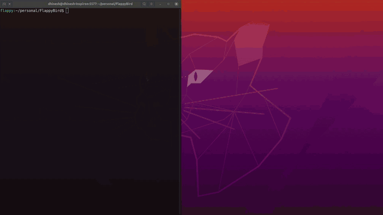

# Flappy-Bird-AI
This a clone of the famous Flappy Bird game and an AI to play the game. Made using [NEAT](https://neat-python.readthedocs.io/en/latest/config_file.html).  



### Instructions to run the AI
1. Clone the repo.  
2. Install the requirements.  
3. Run flappy_bird.py     

You can just copy paste the following lines.  
```
git clone https://github.com/dh1n3sh/Flappy-Bird-AI.git  
cd Flappy-Bird-AI
pip install -r requirements.txt
python flappy_bird.py
```

### Instructions to play the game
Just checkout to `Playable-Game` and run flappy_bird.py   
```
git checkout Playable-Game
python flappy_bird.py
```

You can test drive the code here [](https://gitpod.io/#https://github.com/dh1n3sh/Flappy-Bird-AI)
